# TỔNG HỢP VỀ How JavaSript Works Behind the Scenes

Tìm hiểu xem nguyên tắc JavaScript hoạt động như thế nào.

## Tổng quan chuyên sâu về JavaScript

**(An High-Level Overview Of JavaScript)**

---

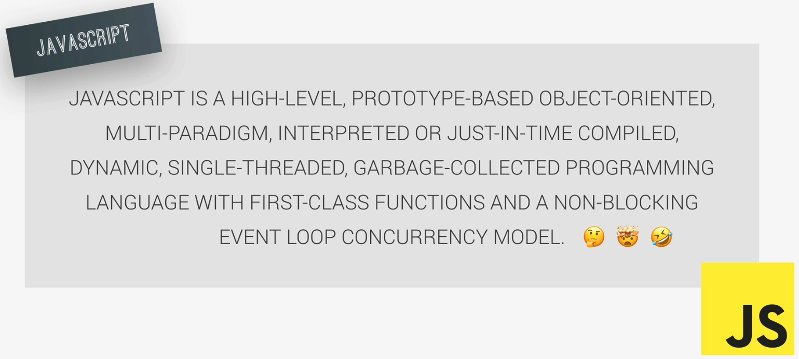

> **_`JAVASCRIPT IS A HIGH-LEVEL, PROTOTYPE-BASED OBJECT-ORIENTED, MULTI-PARADIGM, INTERPRETED OR JUST-IN-TIME COMPILED, DYNAMIC, SINGLE-THREADED, GARBAGE-COLLECTED PROGRAMMING LANGUAGE WITH FIRST-CLASS FUNCTIONS AND A NON-BLOCKING EVENT LOOP CONCURRENCY MODEL.`_**

JAVASCRIPT LÀ **_`NGÔN NGỮ CẤP CAO`_**, DỰA TRÊN **_`NGUYÊN MẪU HƯỚNG ĐỐI TƯỢNG`_**, **_`ĐA MÔ HÌNH`_**, ĐƯỢC **_`PHIÊN DỊCH HOẶC BIÊN DỊCH ĐÚNG LÚC`_**, CÓ TÍNH **_`ĐỘNG`_**, CHẠY **_`ĐƠN LUỒNG`_**, NGÔN NGỮ LẬP TRÌNH **_`THU GOM RÁC`_** VỚI NHỮNG **_`CHỨC NĂNG HẠNG NHẤT`_** VÀ **_`MÔ HÌNH ĐỒNG THỜI VÒNG LẶP SỰ KIỆN`_** KHÔNG CHẶN.

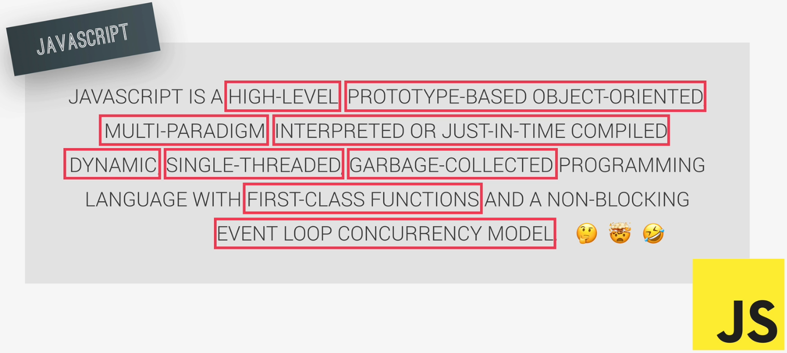

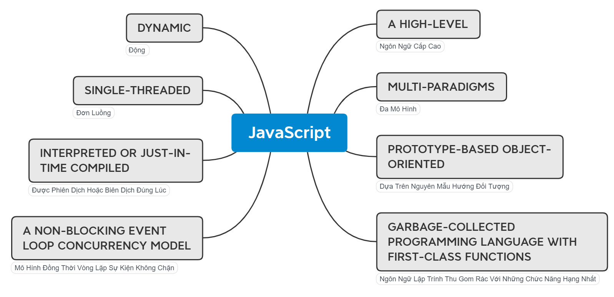

## CHI TIẾT

---

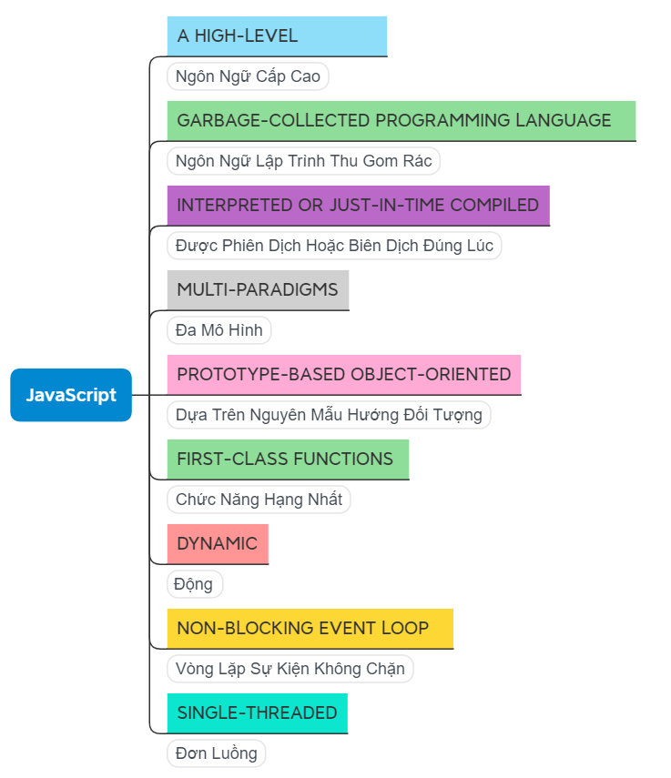

### 1. A Hight-Level

---

Không cần phải xử lý liên quan đến các bộ nhớ để tối ưu chương trình.

- Khi các phần mềm bậc thấp phải khai báo vùng bộ nhớ cần dùng, sau khi sử dụng xong phải clean release hay giải phóng bộ nhớ để tránh bị tràn bộ nhớ.
- Với ngôn ngữ bậc cao thì không cần quan tâm để việc dọn dẹp xử lý bộ nhớ này sau khi thực hiện xong.

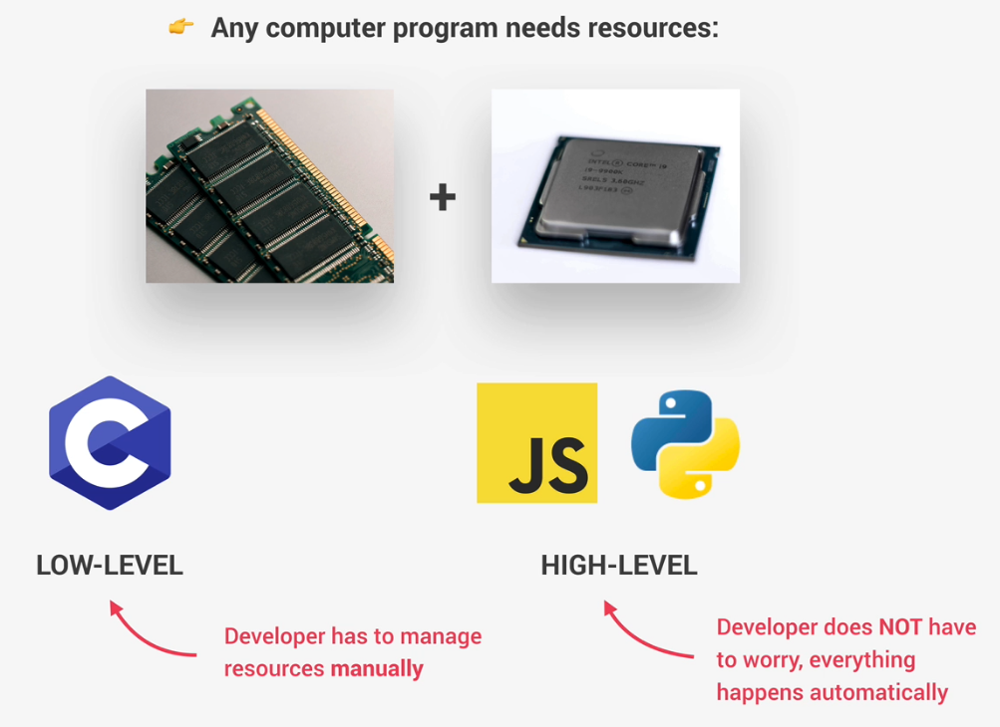

### 2. Garbage-Collected Programming Language

---

Việc xử lý xóa những biến tạm, các khai báo không sử dụng nữa, giải phóng bộ nhớ sẽ được thực hiện tự động.

- Sử dụng thuật toán bên bên trong công cụ của JavaScript.
- Tự động loại bỏ các đối tượng cũ, không sử dụng khỏi bộ nhớ máy tính để khỏi làm nghẽn hay quá tải.
- Làm sạch bộ nhớ theo thời gian và không cần phải thực hiện thao tác này theo cách thủ công.

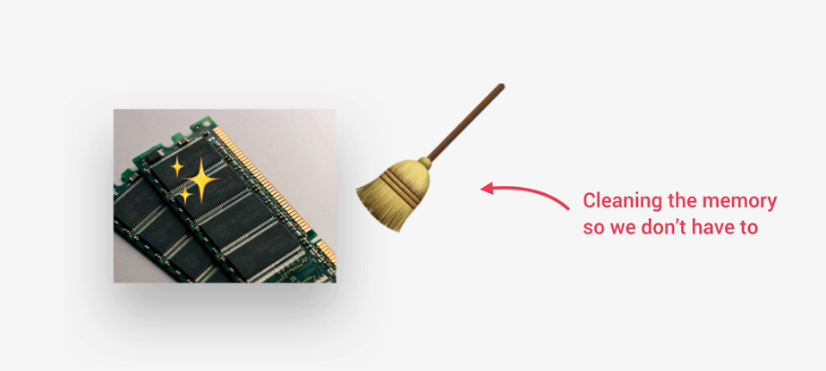

### 3. Interpreted or Just-In-Time Compiled

---

Được phiên dịch hoặc biên dịch cùng lúc khi lập trình viên viết mã.

- Khi viết ngôn ngữ các lập trình viên thường viết bằng ngôn ngữ **_`(Human Code)`_** có thể đọc được dể dàng, nhưng để cho máy tính hiểu thì các ngôn ngữ cần phải được biên dịch qua ngôn ngữ của máy **_`(Machine Code)`_** với các ký tự 0 và 1 để máy có thể thực hiện.

  > Một số ngôn ngữ như: Java, FoxPro, Visual Basic, C#,... cần chạy chức năng Compiled trước khi build ra file .exe hoặc 1 file nào đó, sau đó mới chạy được.

- Nhưng với JavaScript thì việc biên dịch này được thực hiện ngay trong lúc lập trình viên thực hiện viết mã.

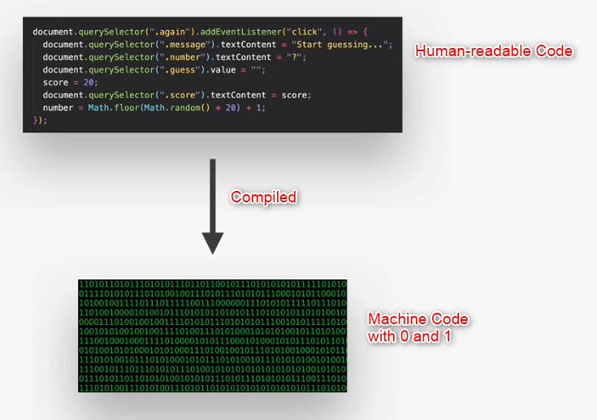

### 4. Multi-Paradigm

---

Ngôn ngữ lập trình Đa mô hình.


> **Paradigm** : **_Mô hình_** là một cách tiếp cận và tư duy tổng thể về cấu trúc mã, nó sẽ định hướng trực tiếp đến phong cách viết mã và các kỹ thuật viết mã code của bạn trong một dự án sử dụng một mô hình nhất định.

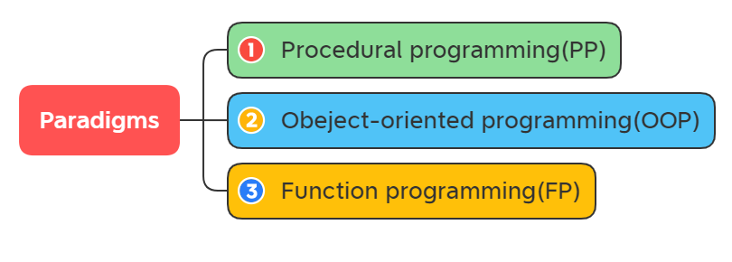

Các mô hình lập trình phổ biến là:

1. Procedural programming(PP) : Lập trình hướng thủ tục trình tự
2. Obeject-oriented programming(OOP) : Lập trình hướng đối tượng
3. Function programming(FP) : Lập trình hàm chức năng

Xem thêm ở [`Functional Programming và Procedural Programming`](./plus20.FP_PP.md).

- Một số ngôn ngữ lập trình chỉ dùng được duy nhất một mô hình.
- Với JavaScript có thể thực hiện cùng lúc áp dụng nhiều mô hình khác nhau trong một dự án. => Linh hoạt và đa năng.

### 5. Prototype-Based Object-Oriented

---

Dựa trên nguyên mẫu hướng đối tượng.

- Trong JavaScript mọi thứ đều là một đối tượng, ngoại trừ 1 số giá trị ban đầu như: số, chuỗi,...
  > Ví dụ như mảng Array cũng được hiểu như một đối tượng.

```js
const arr = [1, 2, 3];
arr.push(4);
console.log(arr);
const hasZero = arr.indexOf(0) > -1;
```

Thực tế là:

- Khi tạo ra một mảng `Arr`
- Sau đó **_Push_** đẩy một giá trị vào mảng `Arr`, chức năng **_Push_** này có được là nhờ mảng `Arr` được tạo nên từ một mảng nguyên mẫu có sẵn, và kế thừa nguyên mẫu với các chức năng của mảng.

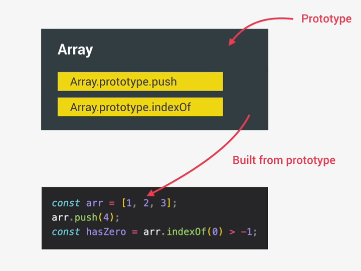

- **_`Prototype Array`_** với mảng nguyên mẫu `prototype` đã có sẵn các `method` chức năng, nên khi tạo mảng Arr mới sẽ dùng được methods:
  - Array.prototype.push()
  - Array.prototype.indexOf()

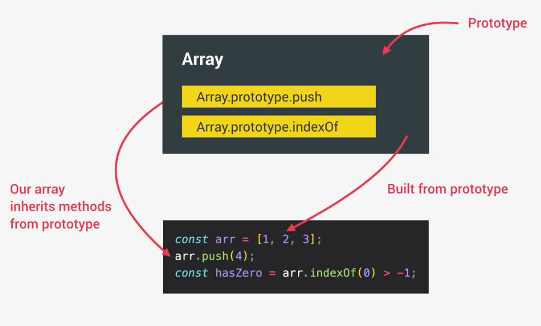

### 6. First Class Function

---

Với các chức năng hạng nhất thì những hàm Function được xem như các biến thông thường, có thể truyền các hàm lồng vào hàm khác, và có thể trả về giá trị là một hàm sau khi thực hiện một hàm.(Call back and Return value)

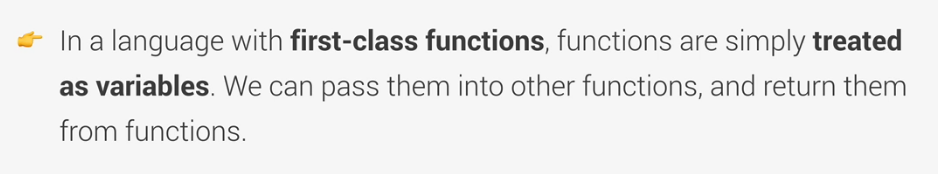

- Điều này cho phép thực hiện mô hình lập trình hàm chức năng (**_`Function programming`_**)

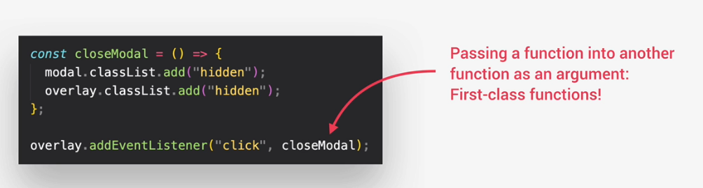

> Ví dụ: Để đóng/ẩn màn hình đã mở trước đó, ta gán thêm chức năng chuyển closeModal vào hàm addEventListener như 1 biến closeModal bình thường.

```js
const closeModal = () => {
    modal.classList.add("hidden);
    overlay.classList.add("hidden);
};

overlay.addEventListener("click", closeModal);
```

- Ở đây khai báo hàm closeModal được hiểu như một biến Variables.

### 7. Dynamic Language

---

Ngôn ngữ động, được nhập động khi khai báo biến.

- Khi khởi tạo biến không cần định nghĩa biến sẽ là kiểu nào như 1 số ngôn ngữ khác.

> Ví dụ: Ngôn ngữ C# cần khai báo kiểu biến khi khởi tạo:

```C++
int d = 3, f = 5;    /* khai báo và khởi tạo biến d và f. */
byte z = 22;         /* khai báo và khởi tạo biến z. */
double pi = 3.14159; /* khai báo và khởi tạo biến pi */
char x = 'x';        /* khai báo và khởi tạo biến ký tự x. */
```

- Trong khi với JavaScript thì không cần khai báo kiểu dữ liệu.

```js
let x = 23; // as Number
let y = 19;
x = "Quang Duy"; // as String
```

- Biến trong quá trình sử dụng sẽ được xác định định dạng dựa trên giá trị truyền vào
- Khi giá trị truyền vào kiểu dữ liệu thay đổi, thì kiểu dữu liệu của biến cũng bị thay đổi.

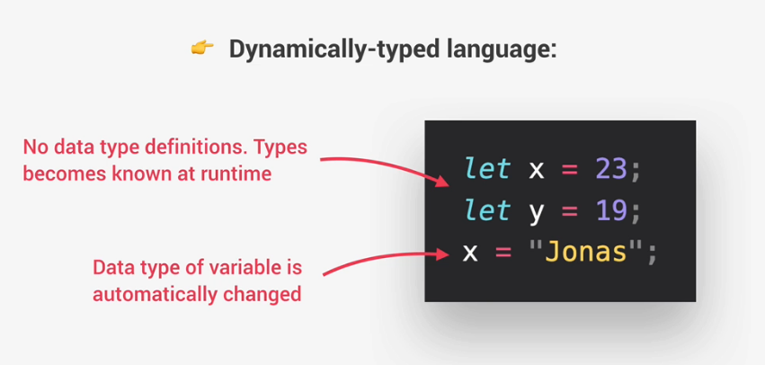

### 8. Single-Threaded & Non-Blocking Event Loop Concurrency

---

- Công cụ JavaScript chỉ có thể chạy thực hiện một việc tại một thời điểm.
- Nhưng có thể xử lý chuyển sang nhiều tác vụ trong cùng 1 thời điểm bằng cách **Concurrency Model**

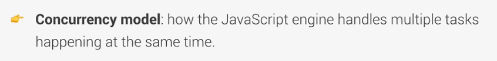

> **Concurrency Model**: cách mà công cụ JavaScript xử lý nhiều tác vụ xảy ra cùng một lúc.

- Khi mà 1 tác vụ nào đó chạy mất quá nhiều thời gian, sẽ làm cho hệ thống bị treo -> với các hệ thông thường khác sẽ chặn tác vụ này lại, nhưng với hệ thống JavaScript thì sẽ không chặn tác vụ này mà dùng **_`Non-Blocking Event Loop Concurrency Model`_** (**_Mô Hình Đồng Thời Vòng Lặp Sự Kiện Không Chặn_**)
- Bằng cách sử dụng vòng lặp, đưa tác vụ chạy mất nhiều thời gian thực thi chúng ở nền (_**`Background`**_), khi nào chúng thực thi xong sẽ mang chúng lại luồng dữ liệu chính để hoàn thành.

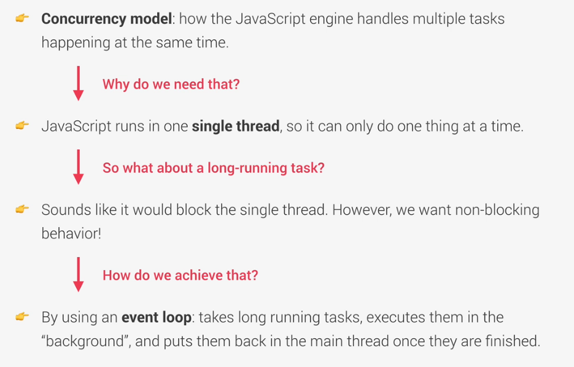

Xem thêm ở [`Functional Programming và Procedural Programming`](./plus20.FP_PP.md).

**HẾT**
