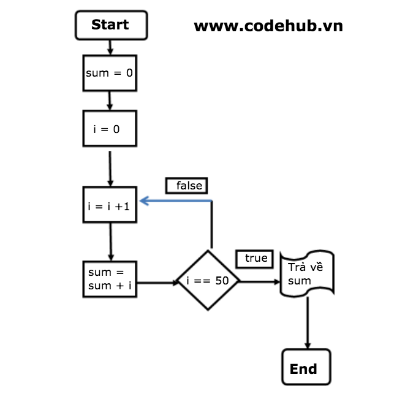

# Functional Programming và Procedural Programming Khác Nhau Như Thế Nào

## Functional Programming Là Gì

---

**_Functional Programming_** (**_`FP`_**) hay lập trình chức năng là một kiểu lập trình mà các bước tính toán xuất hiện bên trong chương trình phần mềm được dựa trên việc ước lượng giá trị trả về từ các hàm và tránh sự thay đổi của trạng thái chương trình cũng như dữ liệu trong của nó.

Để hiểu rõ khái niệm trên thì cách tốt nhất là chúng ta cùng tìm hiểu một ví dụ.

> Ví dụ sau sử dụng `jQuery` để tạo ra hiệu ứng ẩn phần nội dung tóm tắt của bài viết khi người dùng click chuột vào một button trên trang, button này có id nhận giá trị là #hide-summary-button và phần tử HTML chứa nội dung phần tóm tắt có thuộc tính id nhận gía trị là #summary:

```js
$("#hide-summary-button").click(function () {
  $("#summary").hide();
});
```

Như bạn có thể thấy trong đoạn code ở trên chúng ta không khai báo bất cứ biến global nào và do đó tất nhiên sẽ không có sự thay đổi của giá trị các biến trong chương trình. Việc thay đổi giá trị của biến trong chương trình sẽ tạo ra sự thay đổi trạng thái của chương trình.

Rất nhiều ngôn ngữ ngày nay hỗ trợ kiểu lập trình **_Functional Programming_** trong đó có JavaScript, PHP, Ruby... Tuy nhiên đa số đều còn hỗ trợ bổ sung thêm các kiểu lập trình khác chứ không nhất thiết buộc lập trình viên chỉ được sử dụng hàm khi lập trình. Một trong số các kiểu bổ sung kết hợp với lập trình functional đó là **_Procedural Programming_**(**_`PP`_**).

> Lưu ý: Đừng nhầm lẫn khái niệm function với **_Functional Programming_**. Một ngôn ngữ lập trình cung cấp sẵn các hàm hay function và cho phép chúng ta tự định nghĩa các hàm không đồng nghĩa với việc ngôn ngữ lập trình đó hỗ trợ **_Functional Programming_**. C là một ví dụ điển hình trong đó chúng ta có thể sử dụng các hàm nhưng ngôn ngữ này lại thiên về lập trình kiểu thủ tục hay **_Procedural Programming_** hơn là **_Functional Programming_**.

## Procedural Programming Là Gì

---

**_Procedural Programming_** hay còn gọi là lập trình thủ tục là kiểu lập trình mà việc tính toán trong chương trình dựa trên việc ước lượng giá trị của các thủ tục hay procedure (_bao gồm một tập hợp các câu lệnh khác nhau_) theo một **thứ tự xác định từ trên xuống dưới**.

> Một ví dụ về lập trình theo kiểu Procedural Programming đó là một chương trình tính tổng 50 số tự nhiên đầu tiên trong C như sau:

```c++
#include <stdio.h>

int main()
{
int i, sum = 0;

for (i = 1; i <= 50; i++)
{
sum = sum + i;
}

return sum;
}
```

Nếu sử dụng giản đồ để minh hoạ thì đoạn code trong chương trình trên có thể được biểu diễn như trong hình phía dưới đây:


> Lưu ý: Như đã nói ở trên **_`Procedural Programming`_** không có nghĩa là ngôn ngữ không hỗ trợ sử dụng hàm. Ngoài ra thì thuật ngữ procedure và function cũng có ý nghĩa khác giống nhau.

Trong phần lớn các ngôn ngữ lập trình như PHP hay JavaScript thì hai khái niệm này được hiểu là một và đa số mọi người sử dụng thuật ngữ function thay vì prodecure, tuy nhiên trong một số ngôn ngữ lập trình nhất định như C hay Java thì hai thuật ngữ này có một chút ít sự khác biệt.

Đối với các ngôn ngữ mà procedure và function có sự khác nhau thì cả hai đều đều được định nghĩa là một tập hợp bao gồm một hoặc nhiều các dòng lệnh (statement) nhằm thực hiện một tác vụ nào đó. Tuy nhiên function cần trả về giá trị (trường hợp đặc biệt không có giá trị nào dược trả về thì giá trị void sẽ được sử dụng) tuy nhiên procedure thì không cần trả về giá trị.

## Khác Nhau Giữa Functional Programming và Procedural Programming

---

Từ các ví dụ trên chúng ta có thể đưa ra một số so sánh giữa **_`Functional Programming`_** và **`Procedural Programming`** như sau:

- Functional Programming tập trung vào sử dụng tính năng của các hàm và tránh sử dụng các biến cũng như thay đổi giá trị của chúng. Ngược lại Procedural Programming tập trung vào chi tiết hoạt động của chương trình và thường sử dụng các biến và thay đổi trạng thái của chương trình.

- Functional Programming tập trung vào tính năng của các hàm và cách sử dụng chung, ngược lại Procedural Programming tập trung vào việc triển khai chi tiết.

- Functional Programming không bắt buộc chương trình phải chạy các hàm theo một thứ tự xác định và chúng ta có thể thay đổi trật tự của các hàm mà không ảnh hưởng tới chương trình, ngược lại Procedural Programming thì điều này là bắt buộc và thông thường là theo thứ tự từ trên xuống dưới.

> Đa số các ngôn ngữ ngày nay hỗ trợ lập trình viên viết code theo cả hai kiểu lập trình Functional Programming và Procedural Programming.
