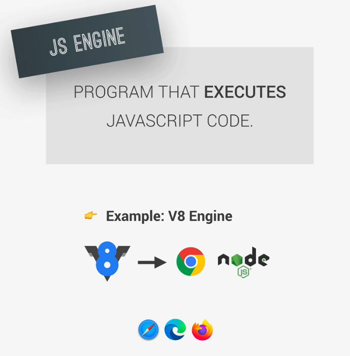
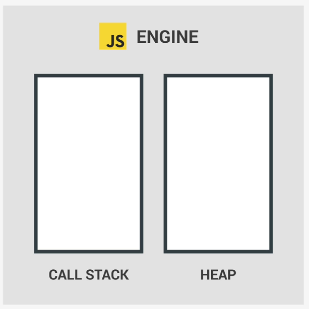
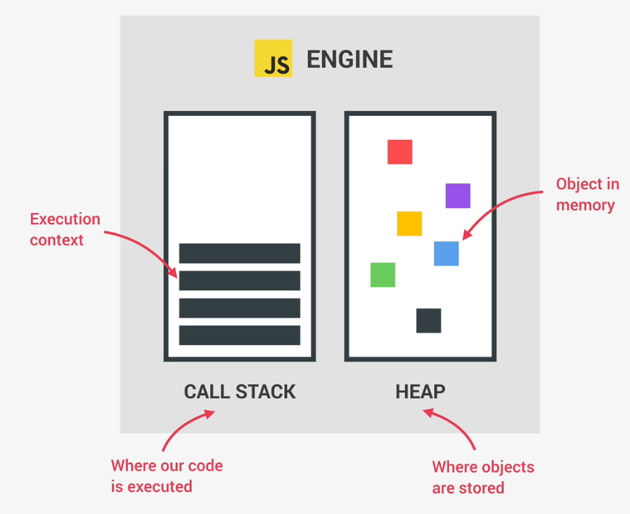
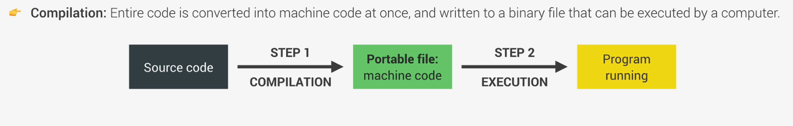
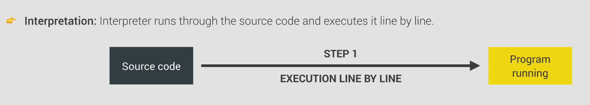
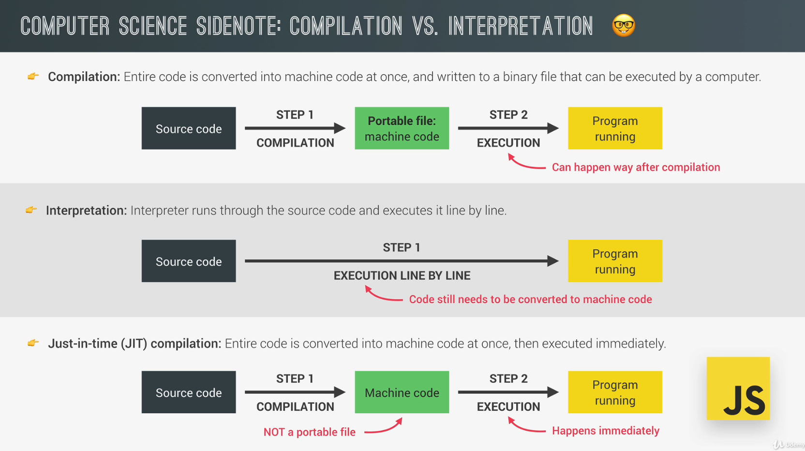

# JAVASCRIPT ENGINE AND RUNTIME

## 1. JavaScript Engine

---

> JavaScript Engine: Program that Executes JavaScript Code.

> Hệ thống JavaScript: Đơn giản được hiểu là một chương trình thực thi các dòng mã lệnh JavaScript.

- Mọi trình duyệt Browser đều có một công cụ Engine phiên dịch mã riêng.
- Như V8 là công cụ được biết đến nhiều nhất của Google, được sử dụng để phiên dịch trình duyệt Chrome và Node.JS được sử dụng để chạy ứng dụng ở máy chủ.
- Ngoài ra còn các công cụ JavaScript khác đi kèm theo các trình duyệt khác.

- Mỗi công cụ JavaScript Engine đều bao gồm 2 thành phần:
  - Call Stack : Ngăn xếp
  - Heap : Đống

- **_`Call Stack`_**: Là nơi thực hiện các dòng lệnh, và các câu lệnh được sắp xếp theo bối cảnh thực thi theo thứ tự (Executes Contents).

- **_`HEAP`_**: Là vùng bộ nhớ không có cấu trúc lưu trữ các đối tượng mà ứng dụng chúng ta cần .

## 2. Compilation vs Interpretation

---

- Biên dịch và Phiên dịch.
- Bộ nhớ máy tính chỉ hiểu được các đoạn mã bao gồm các ký tự 0 và 1.
- Nên mọi ngôn ngữ lập trình cần chuyển đổi qua ngôn nhữ Machine Code để máy tính có thể hiểu và thực thi.
- Việc chuyển đổi sang mã máy này có thể được thực hiện thông qua Biên dịch(Compilation) hoặc Phiên dịch (Interpretation).

### A. Biên dịch(Compilation)

- Trong quá trình biên dịch: thì **_toàn bộ mã nguồn_** được chuyển đổi thành mã máy **_cùng một lúc_**.
- Mã máy này sẽ được chuyển thành 1 tệp, và tệp di động này có thể đem qua một máy tính bất kỳ nào khác đều thực thi sử dụng được.
- Chia quá trình này thành 2 bước:
  - Bước 1: Đầu tiên mã máy được xây dựng viết bằng ngôn ngữ lập trình, và được biên dịch chuyển thành 1 tệp di động Machine Code.
  - Bước 2: Tệp này có thể được đem đi thực thi bởi 1 máy tính khác.

- Việc chạy được tệp này đòi hỏi phải được thực hiện xong quá trình Biên dịch.

### B. Phiên dịch(Interpretation)

- Trong quá trình phiên dịch: thì trình phiên dịch chạy qua toàn bộ mã nguồn, và thực hiện từng dòng mã một.
- Nên chỉ có 1 bước thay vì là 2 bước như Biên dịch(Compilation) và vẫn đảm bảo mã nguồn được chuyển đổi sang ngôn ngữ của máy tính.

- Mã được đọc theo từng dòng, sau đó phiên dịch.
- Việc thực thi phải chờ sau khi dòng mã được biên dịch hoàn chỉnh hoàn tất.
- Trước đây việc đi qua từng dòng mã, và dịch sẽ mất nhiều thời gian và có độ trễ chậm trong thao tác thực thi.

### C. Just-in-time(JIT) Compilation

- Nhưng với JavaScript thì việc phiên dịch này đã được cải thiện và tối ưu;
  toàn bộ mã máy được phiên dịch cùng một lúc và sau đó thực thi ngay lập tức.
  => Just-in-time(JIT) Compilation
- Vẫn tách thành 2 bước, nhưng sẽ không tạo ra tệp di động mà sẽ chuyển đổi thành mã máy và thực thi cùng một lúc.

 Compilation")

- Như vậy ta có tổng quan quá trình này như sau:

## 3. Cách hoạt động của Just-in-time(JIT) Compilation
